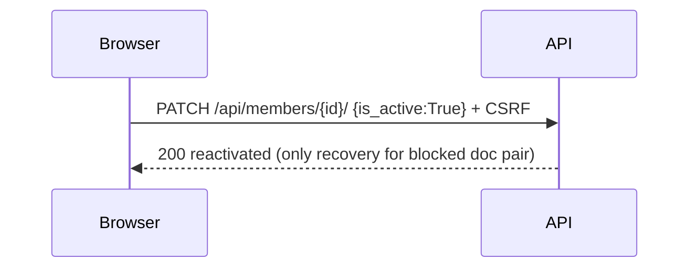

# Design: Member Management (Gestión de Socios)

## Technical Approach

New `members` Django app mirrors `accounts` conventions: explicit `APIView` classes under `/api/members/`, `ModelSerializer` with DB-level `UniqueConstraint`, DRF `PageNumberPagination` (20/page), global `IsAuthenticated` (401-for-anonymous reuse). No new permissions. Frontend adds `MembersList` + `MemberForm` pages at English routes `/members`, `/members/new`, `/members/:id/edit`, extends `src/auth/api.js` member client reusing CSRF helper, migrates `/usuarios/nuevo` → `/users/new`. Implements `member-management` spec; slice 1 (backend) pins the HTTP contract so slice 2 (frontend) builds autonomously.

## Architecture Decisions

| Option | Tradeoff | Decision |
|---|---|---|
| Explicit `APIView` + manual `Q` search vs `ModelViewSet` + `django-filter` | ViewSets/filters shorter; hide permission/query intent, add unwired dep | Explicit `MemberListView`/`MemberDetailView`/`MemberDeactivateView` + manual `Q(first_name__icontains\|last_name__icontains\|document_number__icontains)` + `status` param — follows auth-setup, keeps permission map 1:1, no new dep |
| `UniqueConstraint(document_type, document_number)` table-wide vs partial (active-only) | Partial frees docs but permits duplicate rows/history forks | Table-wide constraint — same pair ALWAYS 400, inactive rows keep blocking; recovery is reactivation only |
| `is_active` writable on update, forced `True` on create | Writable-on-create lets clients birth inactive rows; read-only-everywhere blocks reactivation | Create forces `is_active=True` (read-only in create path); `PUT/PATCH` accepts `is_active` — `PATCH {is_active:True}` is the sole reactivation path |
| Normalization in `Model.save()` + serializer choice validation | DB-only risks 400 noise; serializer-only risks shell-created lowercase | Both: `TextChoices` CC/TI/CE/PA/RC + `serializer.validate_document_type → upper()` + `Model.save() → upper()`; DB constraint stays canonical |
| Audit via view-injected `request.user` vs signals/`CurrentUserMiddleware` | Signals hide authorship, complicate tests | Views pass `created_by/updated_by=request.user` explicitly (`created_*` read-only after create); `created_at auto_now_add`, `updated_at auto_now` |
| Frontend member client in `src/auth/api.js` vs new `src/members/api.js` | New module cleaner long-term; splits CSRF helper, exceeds slice budget | Extend `src/auth/api.js`: generalize `request()` to take full path, add `MEMBERS_BASE="/api/members"` fns (`listMembers({search,status,page})`, `getMember`, `createMember`, `updateMember`, `deactivateMember`) — one-file diff, same CSRF pattern |
| List default `status=active`, ordering `-created_at` vs name | Name ordering pretty; unstable pagination on ties | Default `status=active`; `ordering=-created_at,id` — stable pages, newest first for desk workflow |

## Data Flow

Browser ⇄ Vite `/api` proxy ⇄ DRF views ⇄ `Member` table. Auth: session cookie + `X-CSRFToken` on writes (login flow unchanged).

```mermaid
sequenceDiagram
  Browser->>API: POST /api/members/ {doc, names, phones...} + CSRF
  API->>API: IsAuthenticated; uppercase doc_type; UniqueConstraint check
  API-->>Browser: 201 member (is_active=True, audit=A) | 400 validation/unique | 401 anon
```

```mermaid
sequenceDiagram
  Browser->>API: GET /api/members/?search=juan&status=active&page=2
  API->>API: filter is_active=True; Q icontains across 3 fields; paginate 20
  API-->>Browser: 200 {count, next, previous, results[]}
```

```mermaid
sequenceDiagram
  Browser->>API: POST /api/members/{id}/deactivate/ + CSRF
  API->>API: set is_active=False (idempotent); updated_by=user
  API-->>Browser: 200 {is_active:False} (already-inactive → same 200)
```



## File Changes

| File | Action | Description |
|---|---|---|
| `backend/members/__init__.py`, `apps.py`, `models.py` | Create | `Member` model + `DocumentType(TextChoices)` + `save().upper()` + `UniqueConstraint` + indexes |
| `backend/members/serializers.py` | Create | `MemberSerializer` (read-only `id/created_*/updated_*`; create forces `is_active=True`) |
| `backend/members/views.py` | Create | `MemberListView` (GET+POST), `MemberDetailView` (GET/PUT/PATCH), `MemberDeactivateView` (POST) |
| `backend/members/urls.py` | Create | `""→list`, `"<int:pk>/"`+ `"<int:pk>/deactivate/"` |
| `backend/members/tests.py` | Create | TDD matrix (see below) |
| `backend/config/settings.py` | Modify | Add `members` to `INSTALLED_APPS` |
| `backend/config/urls.py` | Modify | `path("api/members/", include("members.urls"))` |
| `frontend/src/auth/api.js` | Modify | Generalize `request()`; add 5 member fns |
| `frontend/src/pages/MembersList.jsx` | Create | Search input, 3-state filter (Active default), paginated table, inline deactivate confirm, link to reactivate via edit |
| `frontend/src/pages/MemberForm.jsx` | Create | Create/edit form, Spanish copy, `is_active` checkbox visible only on edit |
| `frontend/src/App.jsx` | Modify | `/members`, `/members/new`, `/members/:id/edit` (RequireAuth); `/usuarios/nuevo`→`/users/new` |
| `AGENTS.md` | Modify | SPA routes English / UI copy Spanish / identifiers+API English |

## Interfaces / Contracts

Model (SQLite/Django): `document_type Char(2, choices)`, `document_number Char(32)`, `first_name/last_name Char(100)`, `birth_date Date`, `phone Char(32)`, `email Email(blank,null)`, `address Char(255,blank,null)`, `emergency_contact_name Char(100)`, `emergency_contact_phone Char(32)`, `medical_conditions Text(blank,default="")`, `notes Text(blank,null)`, `is_active Bool(default True)`, `created_at auto_now_add`, `updated_at auto_now`, `created_by/updated_by FK(User, PROTECT, related_name=+)`. Constraints: `UniqueConstraint(document_type, document_number, name="unique_member_document")`; `db_index` on `(last_name, first_name)`, `document_number`, `is_active`.

Status contract (TDD locks): `GET /api/members/?search=&status=active|inactive|all&page=` → 200 paginated / 401 anon. `POST /api/members/` → 201 / 400 validation+unique / 401. `GET /api/members/{id}/` → 200 / 404 / 401. `PUT/PATCH` → 200 / 400 unique / 404 / 401. `POST /{id}/deactivate/` → 200 idempotent / 404 / 401. Non-obvious: `request()` refactor keeps `credentials:"include"` + `X-CSRFToken` when `csrf:true`; `listMembers` builds `URLSearchParams` omitting empty `search`.

## Testing Strategy

| Layer | What to Test | Approach |
|---|---|---|
| Backend | Model: uppercase norm, unique pair, inactive still blocks, TI-123 vs CC-123 allowed; API: list pagination/search×2/status×3/401, retrieve 200/404, create 201/400×2/audit, update PUT/PATCH/400-unique/audit-B, deactivate 200/idempotent/401, reactivate PATCH | `manage.py test members`, `TestCase`+`APIClient`, `enforce_csrf_checks` for write-403 parity |
| Frontend | Guard redirect anon→/login; Active default, Inactive/All switch; deactivate confirm/cancel; old `/usuarios/nuevo` gone, `/users/new` renders | Manual checklist + `pnpm lint` + `pnpm build` (no runner per config) |

## Migration / Rollout

Slice 1 ships migration `0001_initial` (new table, no data move). Rollback: revert commits, remove `members` from `INSTALLED_APPS`/URLs, reverse migration. Slice 2 is additive routes + AGENTS.md line; old route removal is simultaneous rename (no redirect shim — internal tool, staff retrained). No feature flags.

## Open Questions

None — reactivation via `PATCH is_active=True` resolved per spec; search stays explicit `Q` (no `django-filter` wiring).